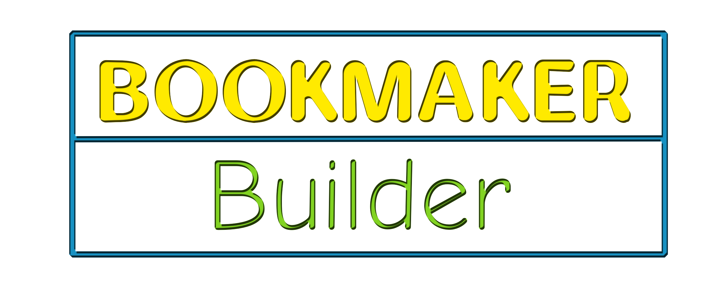

    

   

Construa casas de apostas utilizando dados das principais casas de aposta do mercado. Baseada na biblioteca <a href="https://github.com/victorratts13/radar-sport-api">Radar-sports</a>, você pode construir uma API simples que irá auxiliar na construção de uma casa de apostas com suporte a historico de jogos, tabela de partidas, mais de 20 categorias de esportes, esportes ao vivo, Mais de 100 opções de mercados e construtor de Odds. Confira a documentação.